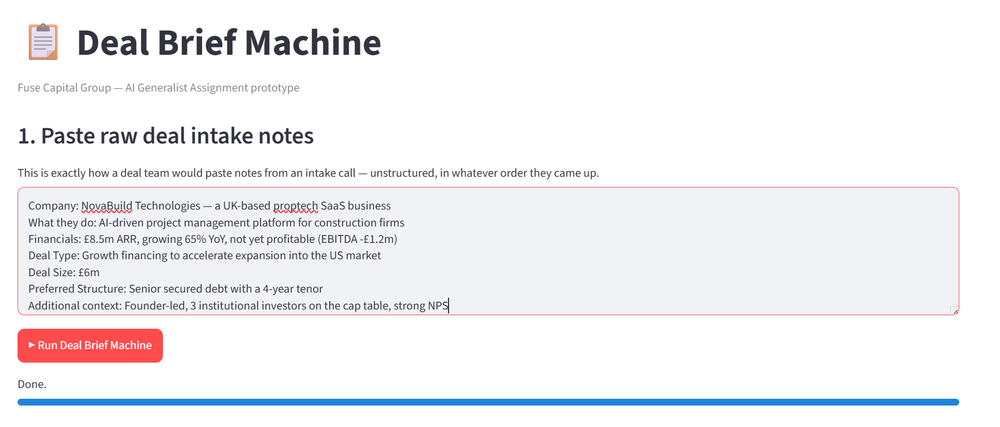
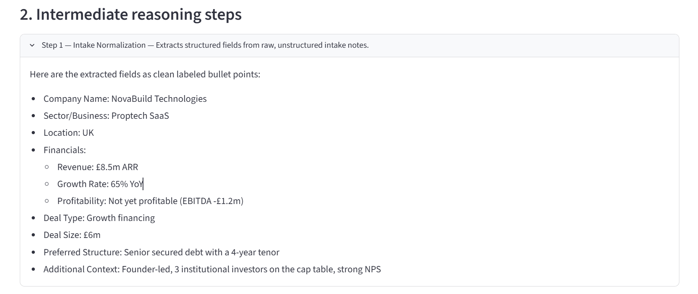
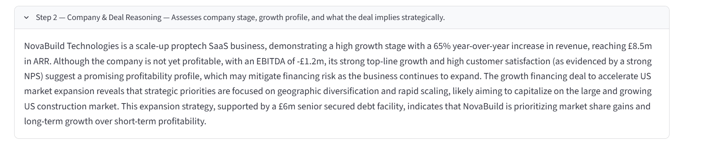
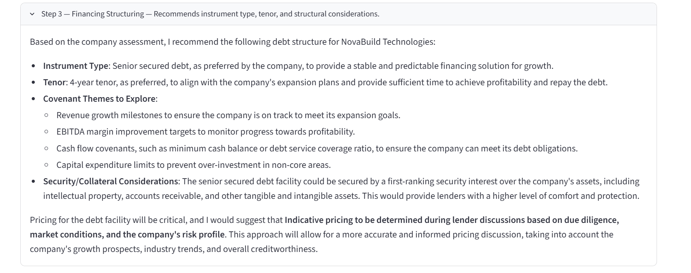
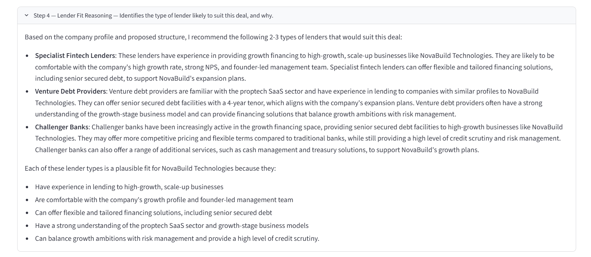
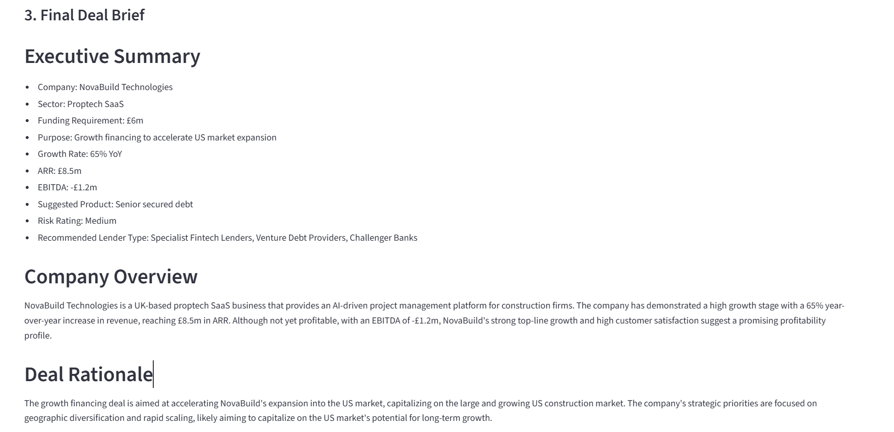
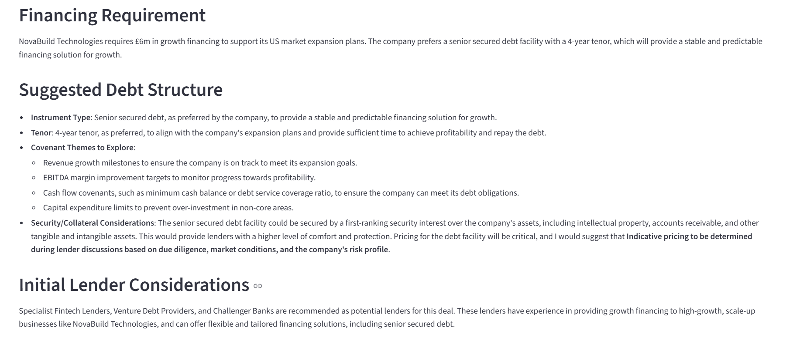
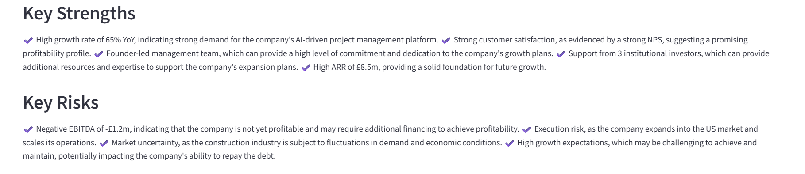
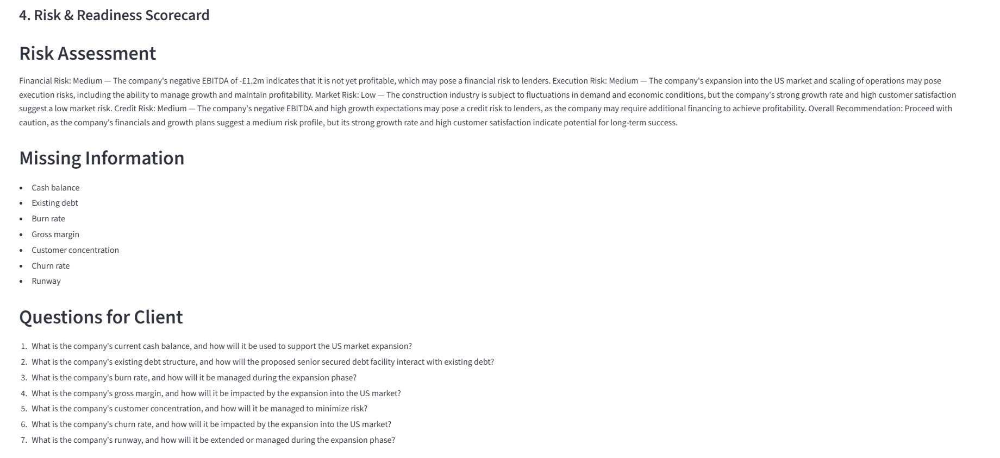
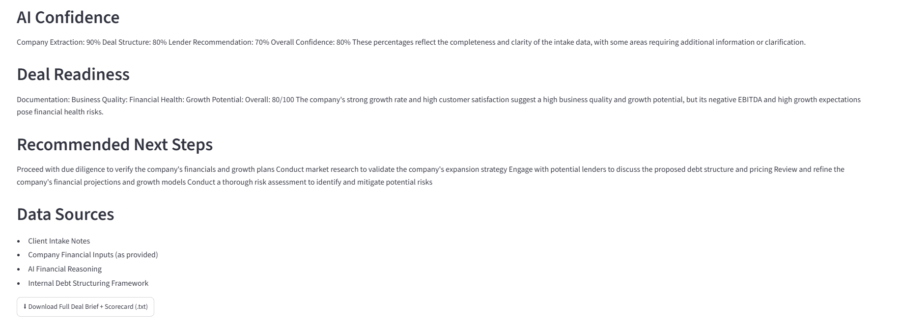

# Deal Brief Machine

An AI tool that turns raw, unstructured deal intake notes into a structured deal brief and a risk & readiness scorecard — built to replace the 3–4 hours a deal team spends manually compiling this for every new mandate.

**Input:** messy notes from an intake call
**Output:** a formatted deal brief + risk scorecard, ready for team review
🔴 **[Live App](https://deal-brief-machine.streamlit.app/)** &nbsp;|&nbsp;

---

## Tech Stack
- **Streamlit** — UI
- **Groq API** (Llama 3.3 70B) — reasoning engine
- **Python 3.9+**
- **python-dotenv** — config management

---

## Project Structure
```
deal_brief_machine/
├── app.py                        # Streamlit UI
├── chain.py                      # runs the 6-step reasoning chain
├── prompts.py                    # step definitions + sample input
├── config.py                     # loads settings from .env
├── .env.example
├── requirements.txt
├── NovaBuild_Deal_Brief.txt       # sample downloaded output
└── 01_Input.png ... 07_Deal_Readiness.png   # sample run screenshots
```

---

## How to Run

```
cp .env.example .env
```
Add your free Groq key (get one at console.groq.com/keys) to `.env`:
```
GROQ_API_KEY=gsk_xxxxxxxxxxxxxxxx
```

```
pip install -r requirements.txt
streamlit run app.py
```
Opens at `http://localhost:8501`. Paste intake notes (or use the pre-filled sample), click **Run Deal Brief Machine**.

---

## Workflow

Six chained AI calls, each step's output feeding into the next:

| Step | Function |
|---|---|
| 1. Intake Normalization | Extracts structured fields from raw notes |
| 2. Company & Deal Reasoning | Assesses stage, profitability, strategic rationale |
| 3. Financing Structuring | Suggests instrument, tenor, covenants |
| 4. Lender Fit Reasoning | Recommends 2–3 suitable lender types |
| 5. Deal Brief Generation | Compiles the formatted brief |
| 6. Risk & Readiness Scorecard | Scores risk, confidence, and readiness |

---

## Features
- End-to-end automated pipeline (paste notes → get finished brief, ~20 seconds)
- Multi-step reasoning chain instead of a single prompt — each stage independently reviewable
- Executive Summary + Key Strengths/Risks in the brief
- Risk Assessment across four dimensions (Financial, Execution, Market, Credit)
- Missing Information + Questions for Client, generated from actual gaps in the input
- AI Confidence scoring, grounded in how complete the intake data was
- Deal Readiness rating (star scores + overall /100)
- Pricing terms are never invented — uses indicative language instead of fabricated rates
- One-click download of the full brief + scorecard as .txt

---

## Sample Output

## Input



## Output

### Step 1 — Intake Normalization



### Step 2 — Company & Deal Reasoning



### Step 3 — Financing Structure



### Step 4 — Lender Fit Analysis



### Step 5 — Final Deal Brief (Part 1)



### Step 5 — Final Deal Brief (Part 2)



### Key Strengths & Key Risks



### Step 6 — Risk & Readiness Scorecard (Part 1)



### Step 6 — Risk & Readiness Scorecard (Part 2)



The complete generated report can also be downloaded directly from the application as **`NovaBuild_Deal_Brief.txt`**.

The generated report includes: Executive Summary, Company Overview, Deal Rationale, Financing Recommendation, Lender Fit Analysis, Key Strengths & Risks, Risk Assessment, Missing Information, Questions for Client, AI Confidence, Deal Readiness Score, and Recommended Next Steps.

---

## Git
```
git remote add origin https://github.com/shraddhashahaof/Deal-Brief-Machine-.git
git push -u origin main
git push -u origin feature/advanced-scorecard
```

## Troubleshooting
- **"No GROQ_API_KEY found"** → check `.env` is named exactly `.env` and sits next to `app.py`
- **Module not found** → run `pip install -r requirements.txt` again
